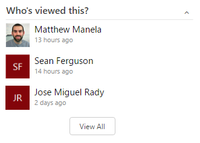
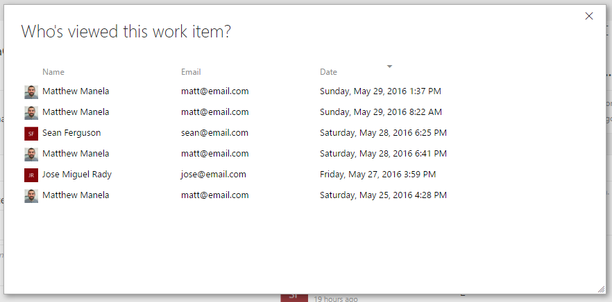

## Who Viewed this Work Item? - VSTS Work Item Form Extension ##

An extension for the [Team Services](https://www.visualstudio.com/en-us/products/visual-studio-team-services-vs.aspx) work item form that tracks who viewed each work item.

### Overview

This extension adds a group to the work item form which shows the most recent distinct people who view the work item. 

Clicking on the __View All__ button takes you to a full view showing every person who visited the worki tem including multiple visits from the same person. 

The number of visits kept for each work item is capped at the 1000 most recent. 

### How it works?

This extensions works by recording each time a person visits a work item. After the form is opened the extension will
wait and see if the person remains on the work item for at least 10 seconds. If so, it then checks to see if the person has
visited the same work item less than 10 minutes ago. If not, it records the visit.

### Feedback

For bugs please use the [issue tracker](https://github.com/mmanela/vsts-workitem-recentlyviewed/issues) on the [GitHub repo](https://github.com/mmanela/vsts-workitem-recentlyviewed).

For feedback/questions contact me on Twitter: [@mmanela](https://twitter.com/mmanela).